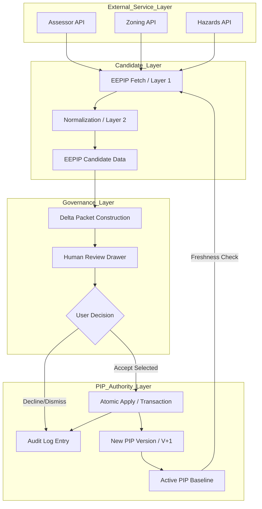

# EEPIP Mutation Lifecycle

This diagram and lifecycle description define the transition of property intelligence from external candidate status to governed internal truth.

## 1. Lifecycle States

1. **Disconnected/Unconnected**: No external data has been requested or linked for this property.
2. **Proposed**: Data has been fetched but has not yet been reviewed or compared.
3. **Pending Review**: A Delta Packet has been constructed; changes are awaiting user approval.
4. **Partially Ingested**: The user accepted a subset of the proposed changes.
5. **Fully Ingested**: The user accepted all proposed changes.
6. **Accepted into PIP**: The point at which proposed changes are committed and the PIP version increments.
7. **Declined/Dismissed**: The user has explicitly rejected or deferred the proposed changes.

## 2. Integrity Rule
Proposed data (from the **Candidate Layer**) must never be rendered as truth in the **PIP Authority Layer** without passing through the **Human Review** decision gate.
